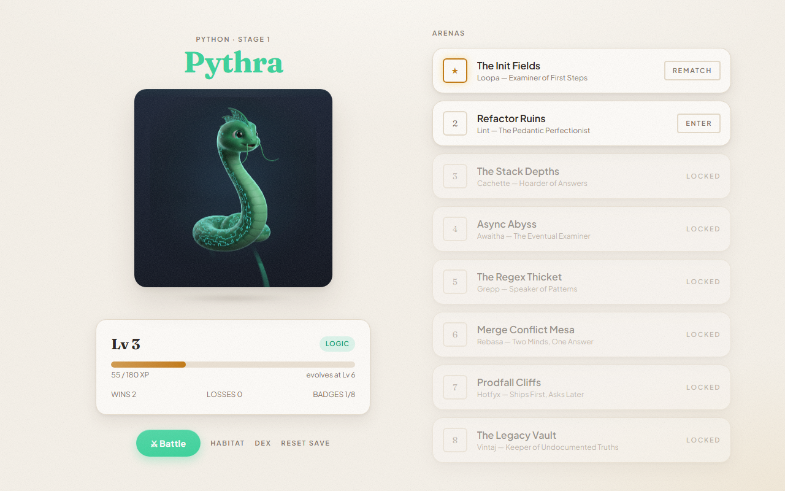
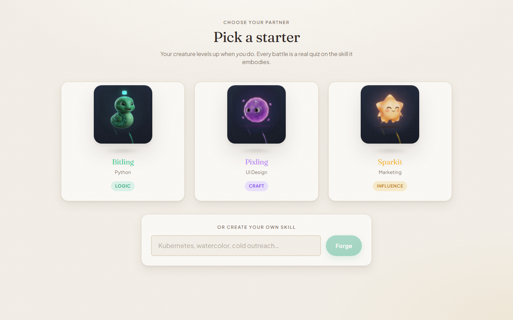
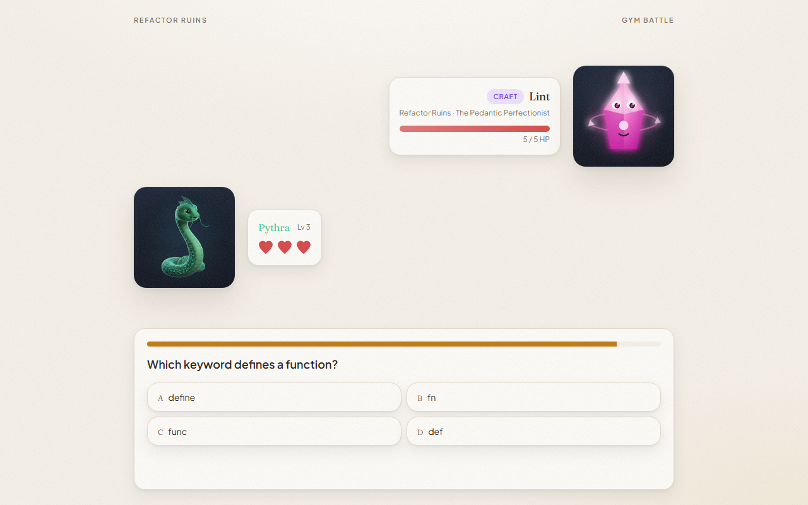
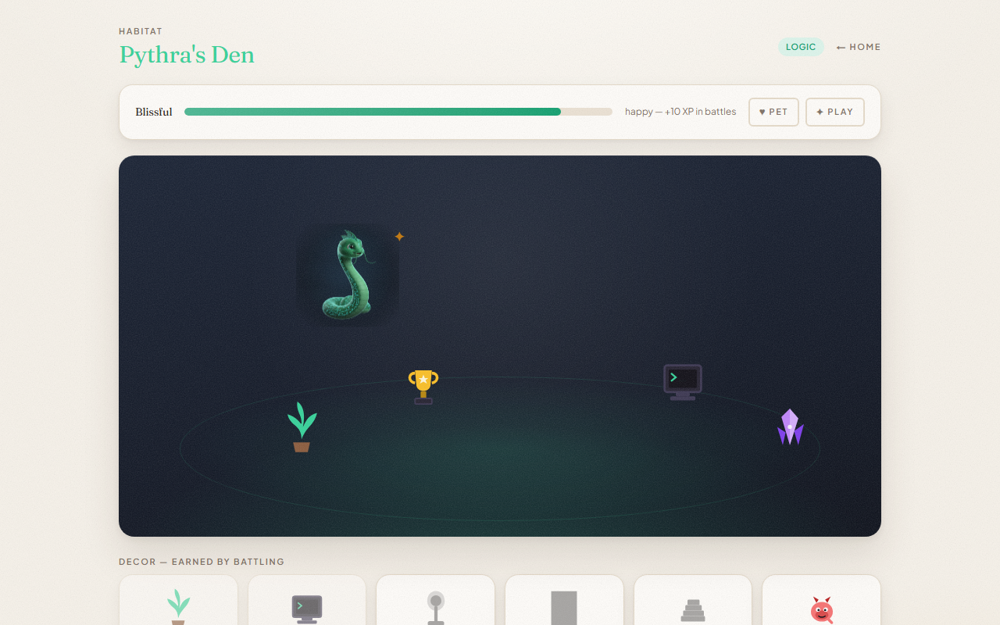
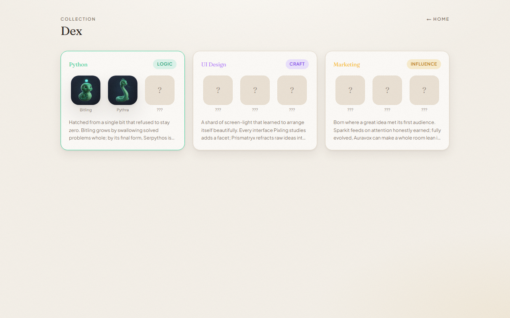

# SKILLMON

**52-Week AI Build Challenge · Week 1 — the "Childhood Dreams" build.**

[](https://github.com/BrendanHerjavec/skillmon/actions/workflows/ci.yml)
[](LICENSE)
[](CONTRIBUTING.md)

[](https://codespaces.new/BrendanHerjavec/skillmon)
[](https://vercel.com/new/clone?repository-url=https%3A%2F%2Fgithub.com%2FBrendanHerjavec%2Fskillmon&env=NEXT_PUBLIC_DEMO_MODE&envDescription=Set%20to%20true%20to%20run%20without%20any%20API%20keys)

> **Try it without installing anything:** click *Open in GitHub Codespaces* above — the app builds and runs in your browser, no keys required. Want to build on it? See [CONTRIBUTING.md](CONTRIBUTING.md); adding a monster or a question pack takes one file.



## The story

As a kid, games let me collect creatures, build worlds, and battle — and I would have done anything to make my monster stronger. SKILLMON is the version of that game that runs on your real life. You pick a skill — Python, UI design, or literally anything you type in — and an AI forges an original creature that embodies it. To level that creature up, you have to pass real quiz battles on the skill, generated adaptively by Claude; wrong answers teach you, streaks hit critical, and work demons like Buggon and Scopecreep stand in your way. Win enough, and you watch your creature evolve on screen — because you actually leveled up first.

## Look around

<table>
  <tr>
    <td width="50%"><br><em><b>Pick a starter</b> — or type any real skill and the AI invents an original creature for it.</em></td>
    <td width="50%"><br><em><b>Battle</b> — real questions on your skill. Streaks hit critical; wrong answers teach.</em></td>
  </tr>
  <tr>
    <td width="50%"><br><em><b>Habitat</b> — pet it, play mini-games, decorate with props earned from wins.</em></td>
    <td width="50%"><br><em><b>Dex</b> — every line you discover, with undiscovered stages sealed.</em></td>
  </tr>
</table>

## Run it

```bash
npm install
cp .env.example .env.local
npm run dev
```

Open http://localhost:3000. Demo Mode is on by default — no API keys, no database, no account needed. Everything falls back to deterministic local content.

### Auto-demo (no clicking required)

The app can play itself, driving the real screens with on-screen narration — load the URL, hit record, walk away:

| URL | What it does |
|---|---|
| `/?auto=1` | **90-second film cut** — title → starter → two battles (streak, critical hit) → level 3 → evolution → rests on the evolved hero shot. Measured at 89s. |
| `/?auto=full` | **Full tour** (~2 min) — everything above, then habitat (petting, decor, a self-playing mini-game) and the Dex. |

Both are also on the title screen as buttons, and in the demo-tools panel. Press **Esc** to take back control at any point. While it runs, the cursor and debug UI are hidden so recordings stay clean.

The 90-second film path: **Title → pick starter → battle Buggon → win with a streak → level 3 → EVOLUTION → Home with the evolved creature and locked arenas.**

After the win, visit the **Habitat**: your creature wanders its den — pet it, decorate with props earned from battles, badges, and evolutions, and hit **✦ play** for three tiny minigames (**Bit Catch**, **Shard Stack**, **Echo Chamber** — your creature's type's game is starred). Games pay mood; a happy creature (mood ≥ 70) fights with a +10 XP bonus. In Demo Mode, the floating **▚ demo** panel (Home/Habitat) grants XP, forces level-ups, unlocks everything, and resets the save so you can test any part of the game in seconds.

### Modes

| Env var | Effect |
|---|---|
| `NEXT_PUBLIC_DEMO_MODE=true` | Local save (no auth), evolution at levels **3/6** instead of 5/12, deterministic question bank fallback, Reset-save button |
| `NEXT_PUBLIC_FILM_MODE=true` | 30s question timers, +25% creature scale, slower animation beats for camera |

### Live AI (optional)

| Key | Unlocks |
|---|---|
| `ANTHROPIC_API_KEY` | Claude-generated adaptive quizzes, custom creature lines + lore, fresh enemy taunts |
| `GEMINI_API_KEY` | Nano Banana sprite generation (reference-chained 3-stage evolution art) |
| Supabase keys | Real persistence via `supabase/schema.sql` (RLS on all tables) |

**High-res creature art is already generated** and committed under `public/sprites/` — all 9 starter stages as 3D-style renders, served statically with no runtime API cost. To regenerate (e.g. after editing prompts in `scripts/generate-sprites.mjs`), set `GEMINI_API_KEY` and run `npm run sprites`; it re-renders every stage with reference-chaining so each line stays one species, and rewrites `content/generatedSprites.ts`. Creatures with no generated art (custom skills) fall back to the procedural SVG renderer automatically.

## Architecture

- **`lib/game/`** — all game math as pure functions (XP curve, damage, streak criticals, type triangle, evolution), unit-tested: `npm test`
- **`lib/ai/`** — typed AI interfaces (`generateQuiz`, `generateCreatureLine`, `narrateBattle`), each with a deterministic fallback; zod-validated JSON contracts
- **`lib/sprites/`** — procedural SVG creature art (3 lines × 3 stages + seeded custom variants)
- **`content/`** — starters, 8 arenas with gym-leader personas, work-demon roster
- **`supabase/schema.sql`** — the week-2+ data model, including the `battle_events` audit trail and `xp_events.source` hook for real-world XP verification (GitHub PRs → Logic XP…)

Judgment calls are logged in [DECISIONS.md](DECISIONS.md). Architecture rules for AI coding agents are in [CLAUDE.md](CLAUDE.md).

## Build on it

MIT licensed — fork it, remix it, ship your own. The content is deliberately separated from the engine, so the easiest contributions need **one file and no knowledge of the game logic**:

| Want to add… | Edit | Time |
|---|---|---|
| A work demon (`Meetingoop`, `Refactorgeist`…) | [`content/enemies.ts`](content/enemies.ts) | 5 min |
| A question pack for a skill you know | [`lib/ai/fallbackQuestions.ts`](lib/ai/fallbackQuestions.ts) | 15 min |
| A habitat prop | [`content/decor.ts`](content/decor.ts) | 10 min |
| An arena + gym leader persona | [`content/arenas.ts`](content/arenas.ts) | 20 min |

Full guide: [CONTRIBUTING.md](CONTRIBUTING.md). Questions are welcome as issues — including "how does this work?" ones.

## License

[MIT](LICENSE) © 2026 Brendan Herjavec. Every creature, enemy, arena, and line of copy is original; this project contains no Pokémon or other franchise IP, and contributions must keep it that way.
